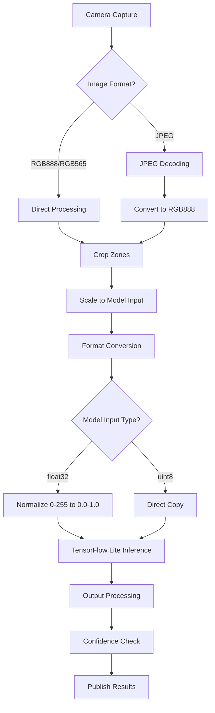

# ESPHome Meter Reader TFLite Component

> General-purpose TensorFlow Lite Micro implementation with camera support for esphome

[](https://esphome.io/)


## 🚀 What is this?

A general-purpose ESPHome component for running TensorFlow Lite Micro models on ESP32 devices.
While originally designed for meter reading, it can be used for any computer vision task including object detection, image classification, and custom AI applications.


## ✨ Key Features

- **🤖 TensorFlow Lite Micro**: Full TFLite Micro runtime support (with operators detection and auto loading)
- **📷 Camera Integration**: State of the art ESP32 camera integration with TrackedBuffer for better memory management and windowing for OV2640 like camera
- **🖼️ Image Preprocessing**: Automatic cropping, scaling, and format conversion
- **⚡ Optimized Performance**: ESP-NN accelerated operations (full image processing and 8 inferences takes less than 3 seconds)
- **🎯 Multi-Zone Processing**: Process multiple regions of interest
- **🔧 Flexible Configuration**: Support for various model types and input formats
- **🐛 Advanced Debugging**: Real-time image analysis and model output inspection

## 🏁 Quick Start

### 1. Installation

***A detailed procedure for setting up is available in [wiki/setup page](https://github.com/nliaudat/esphome_ai_component/wiki/Setup)*** 

Add this to your ESPHome configuration:

```yaml
external_components:
  - source: 
      type: git
      url: https://github.com/nliaudat/esphome_ai_component
      ref: main
    components: [meter_reader_tflite]
```

### 2. Basic Configuration

```yaml
# Configure camera
esp32_camera:
  id: my_camera
  name: "AI Camera"
  resolution: 640x480
  pixel_format: JPEG

# Configure TFLite component
meter_reader_tflite:
  id: tflite_processor
  model: "model.tflite"  # Your TensorFlow Lite model
  camera_id: my_camera
  update_interval: 60s
  debug: false
  debug_image: false # static embedded image (debug.jpg)
  debug_image_out_serial: false
  crop_zones_global: crop_zones  # Reference the global variables set in globals_AI_component.yaml | To update, use http://[hassio]/developer-tools/action >esphome.[s3cam_tflite]_set_crop_zones | to get, use the tools>draw_regions.py
  flash_light : ${id_prefix}flash # optional : flash light at taking image
  flash_pre_time: 7000    # 7 seconds before update (time to stabilize)
  flash_post_time: 2000   # 2 seconds after update
  # ### zoom availale for OV2640, OV3660, OV5640, SC101IOT, SC030IOT from crop zones (explicit)
  # camera_window:  # can be set in http://[hassio]/developer-tools/action > esphome.[s3cam_tflite]_set_camera_window
  #  offset_x: 928 # multiple of 4
  #  offset_y: 480 # multiple of 4
  #  width: 448 # multiple of 4 and 4:3 proportions with height for best quality
  #  height: 88 #  multiple of 4 and 4:3 proportions with width for best quality
  # ### Enhanced validation parameters
  allow_negative_rates: false    # Prevent meter rollbacks
  max_absolute_diff: 300         # Maximum allowed absolute difference
```

### 3. Add Your Model

Place your trained `.tflite` model file in the same directory as your ESPHome configuration.

## 📋 Prerequisites

- **ESP32 board** with camera support
- **ESPHome 2025.09** or newer
- **TensorFlow Lite model** (quantized recommended)

## 🎯 Use Cases

### Computer Vision Applications
- **Object Detection**: Identify objects in camera frames
- **Image Classification**: Categorize images into classes
- **Anomaly Detection**: Detect unusual patterns or events
- **Quality Control**: Inspect products or components
- **Gesture Recognition**: Recognize hand gestures or movements

### Meter Reading (Original Purpose)
- Water, electricity, gas meter digit recognition
- Analog gauge reading
- Digital display extraction

## ⚙️ Configuration Examples

### Basic Object Detection

```yaml
meter_reader_tflite:
  id: object_detector
  model: "object_model.tflite" # Must be in same directory as YAML
  camera_id: my_camera
  update_interval: 30s
  confidence_threshold: 0.7
```

### Image Classification

```yaml
meter_reader_tflite:
  id: image_classifier
  model: "dig-class100-0180-s2-q.tflite"  # Must be in same directory as YAML
  camera_id: my_camera
  update_interval: 60s
  
  # Custom sensor for classification results
sensor:
  - platform: template
    name: "Meter Reading"
    id: meter_value
    unit_of_measurement: "units"
    accuracy_decimals: 0
    icon: "mdi:counter"
    update_interval: 30s
    lambda: |-
      auto reader = id(meter_reader);
      if (reader != nullptr) {
        return reader->get_last_reading();
      }
      return 0.0;

  - platform: template
    name: "Meter Reading Confidence"
    id: meter_confidence
    unit_of_measurement: "%"
    accuracy_decimals: 0
    icon: "mdi:percent"
    update_interval: 30s
    lambda: |-
      auto reader = id(meter_reader);
      if (reader != nullptr) {
        return reader->get_last_confidence() * 100.0; // Convert to percentage
      }
      return 0.0;
```

### Multi-Zone Processing

```yaml
globals:
  - id: detection_zones
    type: string
    initial_value: '[[0,0,400,300],[400,0,800,300],[0,300,400,600],[400,300,800,600]]'

meter_reader_tflite:
  id: multi_zone_detector
  model: "detection_model.tflite"
  camera_id: my_camera
  crop_zones_global: globals.detection_zones
```

### Advanced Configuration with Debugging

```yaml
meter_reader_tflite:
  id: advanced_processor
  model: "custom_model.tflite"
  camera_id: my_camera
  tensor_arena_size: 512KB
  update_interval: 60s
  debug: true
  debug_image: true # static embedded image
  debug_image_out_serial: true
  confidence_threshold: 0.8
```

## 🔧 Model Configuration

### Supported Model Types

The component automatically detects and configures for various model architectures:

```cpp
// Built-in model configurations (model_config.h)
{"class100-0180", ...}     // 100-class classification (0.0-9.9) - 512KB arena
{"class100-0173", ...}     // 100-class classification (0.0-9.9) - 512KB arena  
{"class10-0900", ...}      // 10-class classification (0-9) - 800KB arena
{"class10-0810", ...}      // 10-class classification (0-9) - 800KB arena
{"mnist", ...}             // MNIST-style grayscale models - 900KB arena
```

## Image Processing Flowchart

    
### Processing Steps Explained

1. Image Acquisition: Capture frame from ESP32 camera (JPEG, RGB888, RGB565, or Grayscale)
2. Format Conversion: Convert all formats to standardized RGB888
3. Zone Cropping: Extract regions of interest based on configured crop zones
4. Scaling: Resize cropped regions to match model input dimensions
5. Normalization: Convert pixel values to model-expected range (0-255 or 0.0-1.0)
6. Inference: Run TensorFlow Lite model on prepared input
7. Post-processing: Convert raw model outputs to usable values and confidence scores
8. Result Publication: Send processed results to ESPHome sensors

### Custom Model Support

For custom models, the component auto-detects:
- Input dimensions (width, height, channels)
- Data type (float32, uint8)
- Output processing requirements

### Input Formats
- **RGB888**: 3-channel color images
- **GRAYSCALE**: 1-channel monochrome
- **JPEG**: Automatic decoding to RGB888
- **RGB565**: Automatic conversion


## ⚡ Performance Optimization

### Memory Settings

```yaml
meter_reader_tflite:
  tensor_arena_size: 512KB  # Default, adjust based on model size or if you get bad results
  
  # For larger models:
  # tensor_arena_size: 768KB
  # tensor_arena_size: 1024KB
```

### Camera Optimization

```yaml
esp32_camera:
  resolution: 640x480      # Lower resolution for faster processing
  pixel_format: JPEG       # Convert to RGB888
  jpeg_quality: 20         # If using JPEG, lower quality for speed
  framerate: 1 fps         # Reduce frame rate for periodic processing
```

## 🐛 Debugging & Development

### Enable Debug Output

```yaml
meter_reader_tflite:
  debug: true # the tflite model operators are set manually (model_handler.cpp)
  debug_image: true # static embedded image debug.jpg
  debug_image_out_serial: true #output image to serial console, can be reconstructed with tools/analyze_serial_output.py
```

Debug output includes:
- Model input/output values
- Processing timing statistics
- Memory usage reports
- Image analysis data
- Zone processing details

### Serial Monitoring

```bash
# Monitor debug output
esphome logs your-config.yaml

# Expected debug output example:
# DEBUG: Model input: 32x20x3, output: 10 classes
# DEBUG: Processing time: 45ms
# DEBUG: Zone 1 confidence: 0.92
# DEBUG: Memory usage: 412KB/512KB
```

## 🔍 Troubleshooting

### Common Issues & Solutions

**❌ Model loading fails**
```yaml
# Increase tensor arena size
meter_reader_tflite:
  tensor_arena_size: 768KB  # Increase from 512KB
```

**❌ Poor inference results**
```yaml
# Check model compatibility and preprocessing
meter_reader_tflite:
  debug: true  # Enable debug to see input data
# Increase tensor_arena_size
    tensor_arena_size: 768KB 
```

**❌ Camera frame issues**
```yaml
# Adjust camera settings
esp32_camera:
  resolution: 320x240  # Lower resolution
  framerate: 1 fps     # Reduce frame rate
```

### Performance Tips

1. **Use quantized models** (int8) for better performance
2. **Match input dimensions** to your actual use case
3. **Enable ESP-NN optimizations** (enabled by default)
4. **Use appropriate tensor_arena_size** (start with 512KB)
5. **Optimize update interval** based on your application needs

## 📊 Technical Specifications

- **TensorFlow Lite Version**: Micro 1.3.4
- **ESP-NN Optimization**: Enabled by default
- **Memory Usage**: 512KB tensor arena (configurable)
- **Processing Speed**: 10-1000ms per inference (model-dependent)
- **Supported Operations**: Conv2D, FullyConnected, Pooling, Activation functions, etc.
- **Input Types**: float32, int8, uint8

## 🤝 Contributing

This component is designed to be extensible for various TFLite applications. Contributions welcome!

### Extension Ideas
- Object detection bounding box support
- Multi-model switching
- Custom preprocessing pipelines
- Cloud model updates
- Advanced output decoding

## 📄 License

* Creative Commons Attribution-NonCommercial-ShareAlike 4.0 International (CC-BY-NC-SA)
* No commercial use
* The AI model from haverland is under Apache Licence


---

**Transform your ESP32 camera into an AI vision system!** 🤖✨


*For questions and support, check the GitHub repository discussions section.*

