# Analog Reader Component (Alpha)

> [!WARNING]
> **ALPHA STAGE SOFTWARE**
> This component is currently in **ALPHA**. It is experimental, may be unstable, and the configuration API is subject to change. Use with caution.

This component provides a lightweight, non-AI solution for reading analog gauges (dials) using traditional computer vision.

## 🚀 Performance Gains vs AI
Using this component instead of an AI model (`meter_reader_tflite`) offers significant advantages for standard analog dials:

| Metric | AI Model (TFLite) | Analog Reader (CV) | Gain |
| :--- | :--- | :--- | :--- |
| **RAM Usage** | ~150KB (Tensor Arena) | ~16KB (Image Buffer) | **~10x Less** |
| **Flash Size** | 50KB - 100KB (Model) | < 4KB (Code) | **~25x Smaller** |
| **Latency** | 200ms - 800ms | < 20ms | **~40x Faster** |
| **Complexity** | High (Black box) | Low (Deterministic) | **Simpler** |

**Trade-off**: This valid algorithm requires the dial to be **cleanly cropped and centered**. Unlike AI, it "sees" using strict geometry, so it cannot strictly ignore obstructions or heavy glare as well as a trained network.

## ✨ Improvements (v2)
The latest version (v2) introduces significant enhancements:
*   **Performance**: Trigonometric LUTs (Look-Up Tables) and pre-allocated buffers reduce CPU load and heap fragmentation.
*   **Robustness**: 
    - **Sub-pixel Precision**: Parabolic interpolation provides angle measurement with precision < 1 degree.
    - **Top-Hat Filter**: Improved shadow and lighting variation handling using morphological filtering.
    - **Weighted Voting**: Improved Hough Transform using gradient magnitude as vote weight.
*   **Features**:
    - **Color Detection**: Optional RGB-based detection for specific needle colors (e.g., Red needle on Black dial).
    - **Dynamic Calibration**: Runtime services to adjust dial range and angle limits.

## 🧠 Algorithm Selection Guide

| Algorithm | Speed | Robustness | Best For | Documentation |
| :--- | :--- | :--- | :--- | :--- |
| **Radial Profile** (Default) | Fast (~10ms) | ⭐⭐⭐⭐ | Default. Uses smart "Center Connectivity" and Preprocessing (Top-Hat) to resolve 180° ambiguity and ignore glare. | [Read More](algo_radial.md) |
| **Legacy** | Fast (~10ms) | ⭐⭐ | **Fallback**. Raw intensity scan. Now upgraded with Connectivity checks. Use if filters fail. | [Read More](algo_legacy.md) |
| **Hough Transform** | Slow (~80ms) | ⭐⭐⭐ | Voting-based. Excellent for broken needles or heavy clutter. | [Read More](algo_hough.md) |
| **Template Match** | Very Slow (~150ms) | ⭐⭐ | Brute-force verification. Finds "Brightest Line" in Top-Hat image. | [Read More](algo_template_matching.md) |
| **Auto** | Variable | - | Runs comparison and picks highest confidence. Good for calibration. | - |

> **Note on 180° Ambiguity**: All algorithms now feature **Center Connectivity Logic**. They trace the needle from the hub outwards and stop at gaps. This automatically distinguishes the long "Head" from the short "Tail" of the needle, ensuring accurate 0-360° detection without manual range tuning.

### ✅ Quick Recommendations
*   **For most users**: Use **`Radial Profile`** (Default). It is the smartest and handles most lighting conditions well.
*   **For Battery Devices**: Use **`Legacy`**. It is ultra-lightweight and consumes the least power.
*   **For Broken/Faint Needles**: Use **`Hough Transform`**. It is finding "lines" rather than "blobs", so it detects needles even if they are interrupted by text or glare.
*   **For Tuning**: Use **`Auto`** creates a log with all algorithms' results. Pick the one that is consistently correct for your specific dial.

## 🛠️ Configuration

### Basic Usage
The component allows you to define multiple dials. Each dial detects its needle angle and contributes to a total value.

```yaml
value_validator:
  id: ${id_prefix}_validator
  allow_negative_rates: true  # Analog gauges can go both ways
  max_rate_change: 0.25

analog_reader:
  id: analog_main
  # Camera Reference
  camera_id: my_camera
  
  # Global Settings
  update_interval: 60s
  paused: false         # Start paused?
  debug: false          # Enable ASCII dial visualization in logs
  
  # Validator (recommended)
  validator: ${id_prefix}_validator
  
  # The main sensor reporting the total aggregated value
  value_sensor:
    name: "Total Water Reading"
    
  # List of dials to read
  dials: 
    - id: dial_1
      # Location in the camera frame
      crop_x: 0
      crop_y: 0
      crop_w: 100
      crop_h: 100
      
      # Scale: How much is this dial worth? (e.g. x0.1, x0.001)
      scale: 1.0 
      
      # Image Processing
      auto_contrast: true   # Enhances contrast before processing (Recommended)
      contrast: 1.0         # Manual contrast multiplier
      target_color: 0xFF0000 # Optional: Target needle color (e.g. Red) for Color Detection Mode
      

      # Angle Calibration
      # min/max_angle defines the physical arc of the gauge (e.g. 0 to 360 for full circle)
      min_angle: 0
      max_angle: 360
      
      # Angle Offset: Rotates the coordinate system.
      # 0   = North (12 o'clock)
      # 90  = East  (3 o'clock)
      # 180 = South (6 o'clock)
      # 270 = West  (9 o'clock)
      angle_offset: 0 

### 📐 Visual Guide: Coordinates
The coordinate system is **Clockwise**, starting at **North (12 o'clock)**.

```mermaid
%%{init: {'theme': 'base', 'themeVariables': { 'fontSize': '16px'}}}%%
graph TD
    N((0° North)) --- C[Center]
    C --- E((90° East))
    C --- S((180° South))
    C --- W((270° West))
    
    style N fill:#f9f,stroke:#333
    style E fill:#ccf,stroke:#333
```


*   **Needle at 12 o'clock**: Angle is 0°.
*   **Needle at 3 o'clock**: Angle is 90°.
*   **Needle at 9 o'clock**: Angle is 270°.

**Offset Example**:
If your dial's "Zero" is at 7 o'clock (approx 210°), but you want logical 0° to be there:
*   Set `min_angle: 0`, `max_angle: ...`
*   Set `angle_offset: 210`
*   Algorithm detects 210° -> subtracts 210° -> Result 0°.

### 🔌 Services
The component exposes C++ methods callable from ESPHome lambdas for dynamic calibration:

*   `set_dial_range(dial_id, min_val, max_val)`: Update values (e.g. 0 to 100).
*   `set_dial_angle(dial_id, min_deg, max_deg)`: Update angle limits.

**Example Usage**:
```yaml
button:
  - platform: template
    name: "Calibrate Dial 1"
    on_press:
      then:
        - lambda: |-
            id(analog_main).set_dial_angle("dial_1", 45.0, 315.0);
            id(analog_main).set_dial_range("dial_1", 0.0, 50.0);
``` 
      
      # Value Mapping
      # What values do the min/max angles correspond to?
      min_value: 0
      max_value: 10
      
      # Algorithm Selection
      # detection_algorithm: radial_profile # Options: radial_profile, hough_transform, template_match, legacy, auto
```

### UI Controls Package (Optional)
To easily adjust settings (Pause, Contrast, Update Interval) from Home Assistant, include the provided controls package:

```yaml
packages:
  analog_controls: !include analog_reader_controls.yaml
```

This exposes:
- **Pause Switch**: Stop processing to check logs or save power.
- **Auto Contrast Switch**: Toggle enhancement.
- **Contrast Slider**: Fine-tune contrast (0.1 - 5.0).
- **Update Interval**: Adjust poll rate dynamically.
- **Algorithm Selector**: Switch between detection algorithms (Legacy, Radial Profile, Hough, Template, Auto) at runtime.

### Tuning Guide
1. **Crop**: Ensure your `crop_x/y/w/h` isolates **only** the dial. The center of the crop must be the center of the needle's axis.
2. **Lighting**: Ensure distinct contrast between needle and background. Use `auto_contrast: true` to help normalize lighting conditions.
3. **Offset**: If your needle at "0" points upwards, use `angle_offset: 0`. If it points to the right, use `angle_offset: 90`.
4. **Debugging**: Enable `debug: true` to see an ASCII art representation of the dial in the logs (with colorized needle). This confirms exactly what the ESP32 sees and where it thinks the needle is.

## ⚙️ How it Works
1. **Decode Once**: The full camera frame is decoded to RGB888 just once, optimizing memory.
2. **Extract & Preprocess**: Each diaL crop is extracted. An optional **Top-Hat Filter** removes shadows, leaving only "structure" (the needle).
3. **Multi-Algorithm Analyze**: The selected algorithm analyzes the image:
   - **Radial Profile**: Traces connected rays from center.
   - **Legacy**: Traces raw intensity rays from center.
   - **Hough**: Votes for lines passing through center.
4.  **Detect & Score**: The angle with the highest score (Needle Head) is selected. Connectivity logic ignores the Tail.
5. **Map**: The detected angle is normalized to North-based coordinates.
